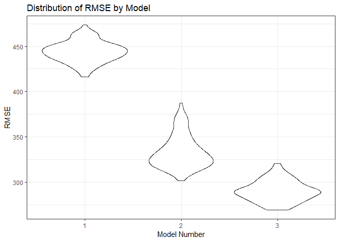

Homework 6
================
Christopher Crowe
November 16, 2018

### Problem 1

The code chunk below puts the data in a format that is appropriate for modeling. For example, it ensures that predictors of interest are the appropriate data types and removes data from some cities that do not report some data. Additionally, it creates a `city_state` variable (e.g. “Baltimore, MD”), and a binary variable indicating whether the homicide is solved.

``` r
homicides = read.csv("./data/homicide-data.csv")

homicides = 
  homicides %>% 
  mutate(city_state = paste(city, state, sep = ", "),
         resolved = as.numeric(disposition == "Closed by arrest"),
         victim_race_2 = case_when(
           victim_race == "Asian" ~ "Non-White",
           victim_race == "Black" ~ "Non-White",
           victim_race == "Hispanic" ~ "Non-White",
           victim_race == "Other" ~ "Non-White",
           victim_race == "Unknown" ~ "Non-White",
           victim_race == "White" ~ "White"
         ),
         victim_race = factor(victim_race_2, levels = c("White", "Non-White")),
         victim_age = as.numeric(as.character(victim_age))
  ) %>% 
  filter(city_state != "Dallas, TX" & city_state != "Phoenix, AZ" & city_state != "Kansas City, MO" & city_state != "Tulsa, AL")
```

    ## Warning in evalq(as.numeric(as.character(victim_age)), <environment>): NAs
    ## introduced by coercion

The following code chunk runs a logistic regression on the dataset and extracts the OR comparing the odds of having a solved homicide for Non-Whites vs. Whites and the corresponding 95% upper and lower confidence limits in Baltimore, MD.

``` r
fit_logistic = 
  homicides %>% 
  filter(city_state == "Baltimore, MD") %>% 
  glm(resolved ~ victim_age + victim_sex + victim_race, data = ., family = binomial())

fit_logistic %>% 
  broom::tidy() %>% 
  janitor::clean_names() %>% 
  mutate(OR = exp(estimate),
         lower_cl = exp(estimate - (1.96 * std_error)),
         upper_cl = exp(estimate + (1.96 * std_error))
  ) %>%
  filter(term == "victim_raceNon-White") %>% 
  select(OR, lower_cl, upper_cl) %>% 
  knitr::kable(digits = 3)
```

|     OR|  lower\_cl|  upper\_cl|
|------:|----------:|----------:|
|  0.441|      0.313|       0.62|

The following code chunk extracts the OR and 95% CI for each city/state in the dataset.

``` r
nest_glm_res =
  homicides %>% 
  group_by(city_state) %>% 
  nest() %>% 
  mutate(models = map(data, ~glm(resolved ~ victim_age + victim_sex + victim_race, data = .x, family = binomial)),
         models = map(models, broom::tidy)) %>% 
  select(-data)

final_homicides = nest_glm_res %>% 
  unnest() %>% 
  janitor::clean_names() %>% 
  mutate(OR = exp(estimate),
         lower_cl = exp(estimate - (1.96 * std_error)),
         upper_cl = exp(estimate + (1.96 * std_error))
  ) %>% 
  filter(term == "victim_raceNon-White") %>%
  select(city_state, OR, lower_cl, upper_cl) 
  
final_homicides %>% 
  knitr::kable(digits = 3)
```

| city\_state        |     OR|  lower\_cl|  upper\_cl|
|:-------------------|------:|----------:|----------:|
| Albuquerque, NM    |  0.741|      0.451|      1.218|
| Atlanta, GA        |  0.753|      0.432|      1.313|
| Baltimore, MD      |  0.441|      0.313|      0.620|
| Baton Rouge, LA    |  0.668|      0.313|      1.425|
| Birmingham, AL     |  1.039|      0.615|      1.756|
| Boston, MA         |  0.115|      0.047|      0.278|
| Buffalo, NY        |  0.390|      0.213|      0.715|
| Charlotte, NC      |  0.558|      0.321|      0.969|
| Chicago, IL        |  0.562|      0.431|      0.733|
| Cincinnati, OH     |  0.318|      0.184|      0.551|
| Columbus, OH       |  0.855|      0.634|      1.152|
| Denver, CO         |  0.602|      0.359|      1.009|
| Detroit, MI        |  0.651|      0.488|      0.869|
| Durham, NC         |  1.003|      0.404|      2.489|
| Fort Worth, TX     |  0.838|      0.555|      1.266|
| Fresno, CA         |  0.448|      0.231|      0.870|
| Houston, TX        |  0.873|      0.699|      1.090|
| Indianapolis, IN   |  0.505|      0.382|      0.667|
| Jacksonville, FL   |  0.658|      0.502|      0.862|
| Las Vegas, NV      |  0.755|      0.586|      0.973|
| Long Beach, CA     |  0.794|      0.388|      1.626|
| Los Angeles, CA    |  0.666|      0.483|      0.918|
| Louisville, KY     |  0.392|      0.259|      0.593|
| Memphis, TN        |  0.782|      0.524|      1.168|
| Miami, FL          |  0.576|      0.377|      0.880|
| Milwaukee, wI      |  0.632|      0.403|      0.991|
| Minneapolis, MN    |  0.646|      0.345|      1.209|
| Nashville, TN      |  0.899|      0.653|      1.236|
| New Orleans, LA    |  0.466|      0.295|      0.737|
| New York, NY       |  0.531|      0.279|      1.011|
| Oakland, CA        |  0.213|      0.104|      0.435|
| Oklahoma City, OK  |  0.681|      0.478|      0.971|
| Omaha, NE          |  0.169|      0.094|      0.305|
| Philadelphia, PA   |  0.644|      0.486|      0.852|
| Pittsburgh, PA     |  0.282|      0.161|      0.493|
| Richmond, VA       |  0.447|      0.162|      1.238|
| San Antonio, TX    |  0.689|      0.461|      1.030|
| Sacramento, CA     |  0.781|      0.449|      1.359|
| Savannah, GA       |  0.596|      0.280|      1.270|
| San Bernardino, CA |  0.880|      0.393|      1.972|
| San Diego, CA      |  0.483|      0.298|      0.785|
| San Francisco, CA  |  0.458|      0.290|      0.723|
| St. Louis, MO      |  0.577|      0.406|      0.820|
| Stockton, CA       |  0.376|      0.196|      0.719|
| Tampa, FL          |  1.159|      0.587|      2.288|
| Tulsa, OK          |  0.602|      0.413|      0.879|
| Washington, DC     |  0.510|      0.258|      1.010|

The below code chunk creates a plot of the ORs and 95% CIs for victim race (non-white vs. white). Based on this plot, we can see which locations have odds ratios that are significantly different from the null value of 1.0. There are no locations where the odds of being resolved is higher for non-white victims than it is for white victims (i.e. no ORs significantly greater than 1.0). However, we can see quite a few locations where the odds of being resolved is lower for non-white victims than it is for white victims (i.e. some ORs are significantly less than 1.0). Boston, MA has the lowest OR (~0.68).

``` r
final_homicides %>% 
  arrange(desc(OR)) %>% 
  mutate(city_state = forcats::fct_inorder(city_state)) %>% 
  ggplot(aes(x = city_state, y = OR)) +
  geom_point() +
  geom_errorbar(aes(ymin = lower_cl, ymax = upper_cl)) +
  labs(
    x = "City & State",
    y = "Estimated Odds Ratio Comparing Non-White to White",
    title = "Odds Ratios of Resolved Homicides Comparing Non-White to White"
  ) +
  scale_y_continuous(expand = c(0,0)) +
  theme_bw() +
  theme(axis.text.x = element_text(angle = 90, hjust = 1, size = 6))
```


### Problem 2

The following code chunk reads in the data and ensures that all categorical variables are labeled appropriately and treated as factor variables with appropriate reference levels. Additionally, this code chunk checks to see how many missing values are in this dataset, and we see that there are 0 missing values.

``` r
birthweight = read.csv("./data/birthweight.csv") %>% 
  mutate(
    babysex = case_when(
      babysex == 1 ~ "Male",
      babysex == 2 ~ "Female"),
    babysex = fct_relevel(babysex, "Male"),
    frace = case_when(
      frace == 1 ~ "White",
      frace == 2 ~ "Black",
      frace == 3 ~ "Asian",
      frace == 4 ~ "Puerto Rican",
      frace == 8 ~ "Other",
      frace == 9 ~ "Unknown"
      ),
    frace = fct_relevel(frace, "White"),
    mrace = case_when(
      mrace == 1 ~ "White",
      mrace == 2 ~ "Black",
      mrace == 3 ~ "Asian",
      mrace == 4 ~ "Puerto Rican",
      mrace == 8 ~ "Other"
      ),
    mrace = fct_relevel(mrace, "White"),
    malform = case_when(
      malform == 1 ~ "Present",
      malform == 0 ~ "Absent"
    ),
    malform = fct_relevel(malform, "Absent")
    )

sum(is.na(birthweight))
```

    ## [1] 0

The following code chunk creates a linear model to predict a baby's birthweight based on a variety of information from the mother. Based on my general intution about birthweight, I included the following predictors in my initial model: mother's weight at delivery (pounds), gestational age in weeks, mother's pre-pregnancy weight (pounds), average number of cigarettes smoked per day during pregnancy, previous number of low birthweight babies, and mother's weight gain during pregnancy (pounds). I then used a step-wise model selection process to determine which of these predictors should be included in the final model. The final model contains: mother's weight at delivery (pounds), gestational age in weeks, mother's pre-pregnancy weight (pounds), and average number of cigarettes smoked per day during pregnancy.

``` r
model_1 = 
  lm(bwt ~ delwt + gaweeks + ppwt + smoken + pnumlbw + wtgain, data = birthweight) %>% 
  stepAIC(direction = "both")
```

    ## Start:  AIC=52954.63
    ## bwt ~ delwt + gaweeks + ppwt + smoken + pnumlbw + wtgain
    ## 
    ## 
    ## Step:  AIC=52954.63
    ## bwt ~ delwt + gaweeks + ppwt + smoken + pnumlbw
    ## 
    ## 
    ## Step:  AIC=52954.63
    ## bwt ~ delwt + gaweeks + ppwt + smoken
    ## 
    ##           Df Sum of Sq        RSS   AIC
    ## <none>                  857638849 52955
    ## - ppwt     1  11095781  868734630 53008
    ## - smoken   1  11778559  869417408 53012
    ## - delwt    1  47839493  905478342 53188
    ## - gaweeks  1 155577283 1013216132 53676

``` r
model_1 = 
  lm(bwt ~ delwt + gaweeks + ppwt + smoken, data = birthweight)
```

The following code chunk creates a plot of the residuals and predicted values for the model we just created. From this plot, we can see that this linear model is NOT optimal. If it were optimal, we'd expect to see a generally horizontal band around 0. However, we can see that the residuals at the lower end of the scale are relatively far from 0.

``` r
birthweight %>% 
  modelr::add_residuals(model_1) %>% 
  modelr::add_predictions(model_1) %>% 
  ggplot(aes(x = pred, y = resid)) +
    geom_point() +
  labs(
    x = "Predicted values",
    y = "Residual values",
    title = "Model 1 - Predicted vs. Residual"
  )
```


The following code chunk creates two additional linear models.

``` r
model_2 = lm(bwt ~ blength + gaweeks, data = birthweight)


model_3 = lm(bwt ~ bhead + blength + babysex + bhead*blength*babysex + bhead*blength + bhead*babysex + blength*babysex, data = birthweight)
```

The following code chunk compares the three linear models we just created using the `crossv_mc` function. We can see that the distribution of RMSE values is much higher for model 1 than it is for models 2 and 3. Model 3 (with head circumference, length, sex, and all interactions) appears to be the best model since it has the smallest RMSE values.

``` r
cv_birthweight = 
  crossv_mc(birthweight, 100)

cv_birthweight = 
  cv_birthweight %>% 
  mutate(model_1 = map(train, ~lm(bwt ~ delwt + gaweeks + ppwt + smoken, data = .x)),
         model_2 = map(train, ~lm(bwt ~ blength + gaweeks, data = .x)),
         model_3 = map(train, ~lm(bwt ~ bhead + blength + babysex + bhead*blength*babysex + bhead*blength + bhead*babysex + blength*babysex, data = .x))) %>% 
  mutate(rmse_1 = map2_dbl(model_1, test, ~rmse(model = .x, data = .y)),
         rmse_2 = map2_dbl(model_2, test, ~rmse(model = .x, data = .y)),
         rmse_3 = map2_dbl(model_3, test, ~rmse(model = .x, data = .y)))

cv_birthweight %>% 
  select(starts_with("rmse")) %>% 
  gather(key = model, value = rmse) %>% 
  mutate(model = str_replace(model, "rmse_", ""),
         model = fct_inorder(model)) %>% 
  ggplot(aes(x = model, y = rmse)) + geom_violin() +
  theme_bw() +
  labs(
    x = "Model Number",
    y = "RMSE",
    title = "Distribution of RMSE by Model"
  )
```


